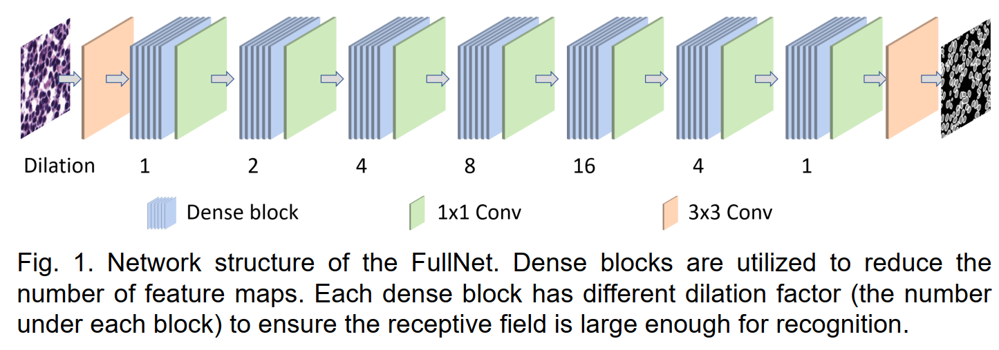

# FullNet and varCE loss for gland/nuclei segmentation

This repository contains the pytorch code for the paper:

Improving Nuclei/Gland Instance Segmentation in Histopathology Images by Full Resolution Neural Network
and Spatial Constrained Loss, MICCAI2019. ([PDF](https://doi.org/10.1007/978-3-030-32239-7_42))

If you find this code helpful, please cite our work:

```
@inproceedings{Qu2019miccai,
    author = "Hui Qu, Zhennan Yan, Gregory M. Riedlinger, Subhajyoti De, and Dimitris N. Metaxas",
    title = "Improving Nuclei/Gland Instance Segmentation in Histopathology Images by Full Resolution Neural Network and Spatial Constrained Loss",
    booktitle = "Medical Image Computing and Computer Assisted Intervention -- MICCAI 2019",
    year = "2019",
    pages = "378--386",
}
```

## Introduction

The networks and cross entropy loss in current deep learning-based segmentation methods originate from image 
classification tasks and have two main drawbacks: (1) pooling/down-sampling operation eliminates the details in 
feature maps, and (2) cross entropy loss only cares about individual pixels. To solve these problems, in this paper
we propose a full resolution convolutional neural network (FullNet) that maintains full resolution feature maps to 
improve the localization accuracy. We also propose a variance constrained cross entropy (varCE) loss that encourages 
the network to learn the spatial relationship between pixels in the same instance. Experiments on a nuclei segmentation 
dataset and the 2015 MICCAI Gland Segmentation Challenge dataset show that the proposed FullNet with the varCE
loss achieves state-of-the-art performance.




## Dependecies
Ubuntu 16.04

Pytorch 0.4.1

Python 3.6.6

SimpleITK 1.1.0

## Usage


To training a model, set related parameters in the file `options.py` and run `python train.py`, or run the script
`sh scripts/run_GlaS.sh`

To evaluate the trained model on the test set, set related parameters in the file `options.py` and 
run `python test.py`. You can also evaluate images without ground-truth labels by simply setting
`self.test['label_dir']=''` in the file `options.py` and run `python test.py`.
